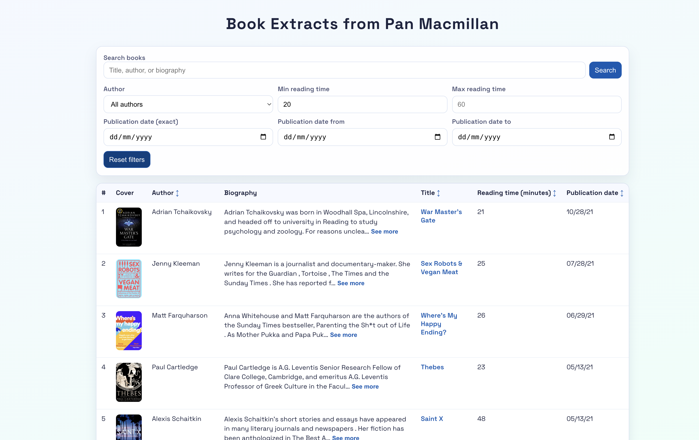
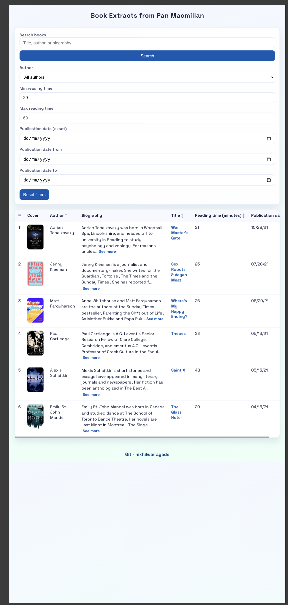

# Book Extracts from Pan Macmillan - Frontend

Single-page React application for browsing and filtering Pan Macmillan book extracts.

## Overview

This app:

- Fetches books from a local Azure Functions backend
- Renders books in a responsive, sortable table
- Supports search and multiple filters
- Uses SCSS for handcrafted styling
- Uses Moment for publication date formatting (`MM/DD/YY`)

## UI Preview



- Responsive


## Features

- Header, table body, and footer layout
- Table columns:
	- Sequence number
	- Cover
	- Author
	- Biography (See more / See less)
	- Title
	- Reading time (minutes)
	- Publication date
- Cover and Title link to extract URL via ISBN
- 3-state sorting (`ascending -> descending -> default`) for:
	- Title
	- Author
	- Reading time
	- Publication date
- Search through backend API
- Frontend filters:
	- Author (single-select dropdown)
	- Reading time range
	- Publication date exact/from/to
- Loading, empty, and error states

## Prerequisites

- Node.js (LTS recommended)
- npm

## Local Setup

1. Install dependencies:

```bash
npm install
```

2. Start frontend:

```bash
npm start
```

3. Open in browser:

`http://localhost:3000`

## Backend Dependency

Frontend expects backend API at:

`http://localhost:7071/api/books`

Make sure backend is running before using search/filter features.

## Scripts

```bash
npm start
```

Runs the development server.

```bash
npm test
```

Runs frontend tests.

```bash
npm run build
```

Builds optimized production bundle.

## API Contract Used

Request:

- Method: `POST`
- Endpoint: `/api/books`
- Body: `{ "query": "optional text" }`

Success response:

```json
{
	"success": true,
	"message": "...",
	"data": []
}
```

Error response:

```json
{
	"success": false,
	"message": "...",
	"errorCode": "..."
}
```

## Notes

- Frontend and backend are designed to run locally.
- No Azure account is required for local development.
